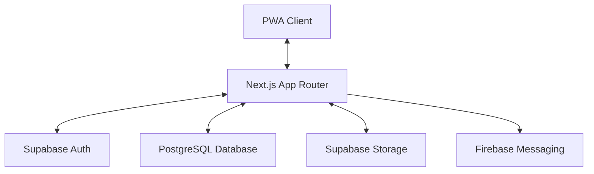
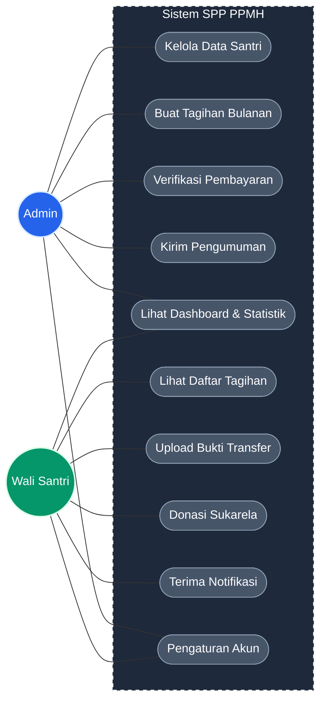
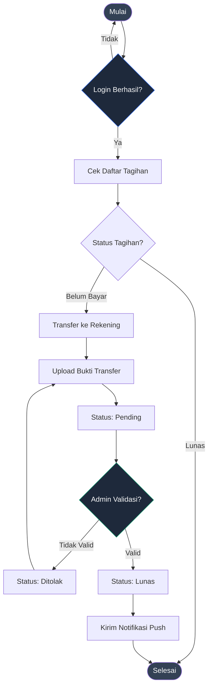
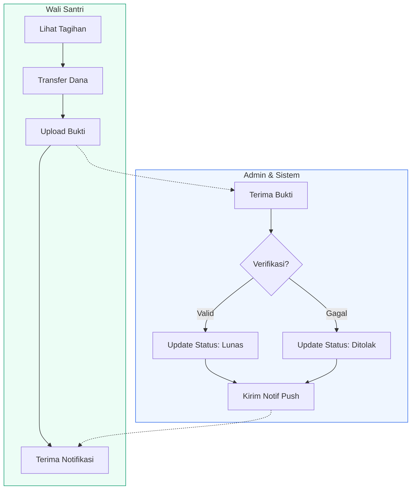
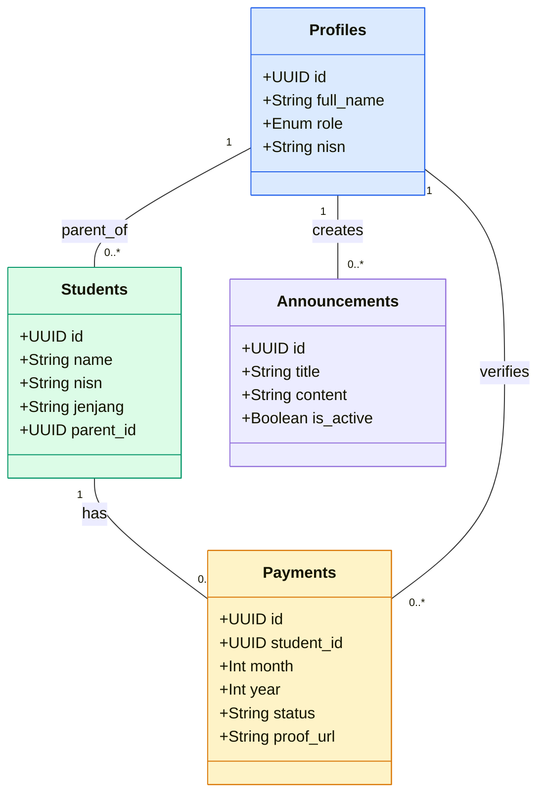
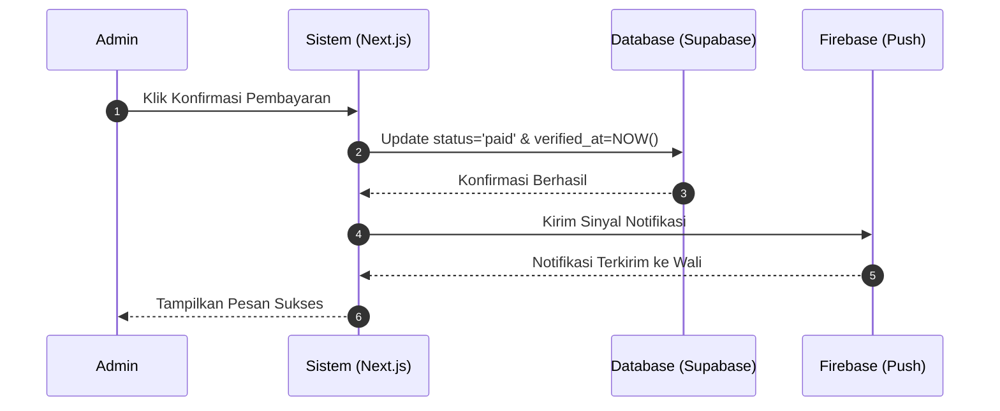

# Dokumentasi Lengkap Perancangan Sistem SPP PPMH

Dokumen ini berisi perancangan teknis menyeluruh untuk Sistem Informasi Pembayaran (SPP) Pondok Pesantren Minhajush Sholihin (PPMH). Sistem ini dirancang untuk mendigitalisasi proses keuangan dengan arsitektur modern berbasis PWA.

---

## 1. Arsitektur Sistem (Overview)
Sistem dibangun menggunakan stack teknologi **Next.js 14**, **Supabase**, dan **Firebase Cloud Messaging**.

---

## 2. Use Case Diagram (System Boundary)
Mendefinisikan interaksi antara pengguna (Admin & Wali Santri) dengan fungsi-fungsi utama sistem.

---

## 3. Flowchart (Alur Logika Pembayaran)
Menunjukkan logika alur kerja dari sisi teknis sistem.

---

## 4. Activity Diagram (Proses Bisnis)
Menggambarkan aktivitas berurutan antara Wali Santri dan Admin.

---

## 5. Class Diagram (Struktur Data)
Menjelaskan relasi antar tabel dalam database Supabase.

---

## 6. Sequence Diagram (Verifikasi Pembayaran)
Menunjukkan urutan pertukaran pesan antar komponen saat verifikasi.

---

## 7. Desain Antarmuka (Interface Design)

### 7.1 Filosofi Desain
*   **Dark Mode**: Mengurangi ketegangan mata dan memberikan kesan premium.
*   **Glassmorphism**: Memberikan kedalaman visual melalui efek transparansi.
*   **Mobile-First**: Optimal untuk diakses melalui smartphone wali santri.

### 7.2 Palet Warna & Tipografi
*   **Warna Utama**: Deep Navy (`#0f172a`), Emerald Green (`#10b981`), Sky Blue (`#0ea5e9`).
*   **Font**: Inter / Roboto (Sans Serif) untuk keterbacaan tinggi.

### 7.3 Konsep Visual (Mockup)

*Gambar 7.1: Konsep Dashboard Admin dengan tema Dark Mode & Glassmorphism.*

---

## 8. Kamus Data (Data Dictionary)

Berikut adalah detail teknis dari struktur tabel utama di Supabase:

### 8.1 Tabel: `profiles`
| Kolom | Tipe Data | Deskripsi |
| :--- | :--- | :--- |
| `id` | UUID (PK) | ID unik dari Supabase Auth. |
| `full_name` | Text | Nama lengkap pengguna. |
| `role` | Enum | Peran pengguna: `admin`, `parent`. |
| `nisn` | Text (Unique) | NISN santri (khusus untuk role parent). |

### 8.2 Tabel: `students`
| Kolom | Tipe Data | Deskripsi |
| :--- | :--- | :--- |
| `id` | UUID (PK) | ID unik santri. |
| `name` | Text | Nama santri. |
| `nisn` | Text (Unique) | Nomor Induk Siswa Nasional. |
| `jenjang` | Enum | `sd_mi`, `smp_mts`, `sma_ma`, `kuliah`. |
| `parent_id` | UUID (FK) | Relasi ke tabel `profiles`. |

### 8.3 Tabel: `payments`
| Kolom | Tipe Data | Deskripsi |
| :--- | :--- | :--- |
| `id` | UUID (PK) | ID unik transaksi. |
| `student_id` | UUID (FK) | Relasi ke tabel `students`. |
| `month` | Integer | Bulan tagihan (1-12). |
| `year` | Integer | Tahun tagihan. |
| `status` | Enum | `unpaid`, `pending`, `paid`, `rejected`. |
| `proof_url` | Text | Link ke file bukti bayar di Storage. |

---

## 9. Panduan Deployment & Konfigurasi

Sistem ini dirancang untuk di-deploy dengan mudah menggunakan integrasi CI/CD.

### 9.1 Environment Variables
Pastikan variabel berikut dikonfigurasi di Vercel:
- `NEXT_PUBLIC_SUPABASE_URL`: URL API Supabase Anda.
- `NEXT_PUBLIC_SUPABASE_ANON_KEY`: Anon Key untuk akses publik.
- `SUPABASE_SERVICE_ROLE_KEY`: Key admin untuk operasi backend.
- `FIREBASE_SERVER_KEY`: Khusus untuk integrasi notifikasi push.

### 9.2 Keamanan (Row Level Security)
Database menggunakan kebijakan RLS untuk memastikan:
1. **Admin**: Memiliki akses penuh (SELECT, INSERT, UPDATE, DELETE) ke semua tabel.
2. **Wali Santri**: Hanya bisa melihat data santri dan tagihan yang sesuai dengan NISN mereka.
3. **Publik**: Tidak memiliki akses ke data sensitif.

---
**Dokumentasi ini dibuat untuk proyek SPP PPMH Silir Sari.**
