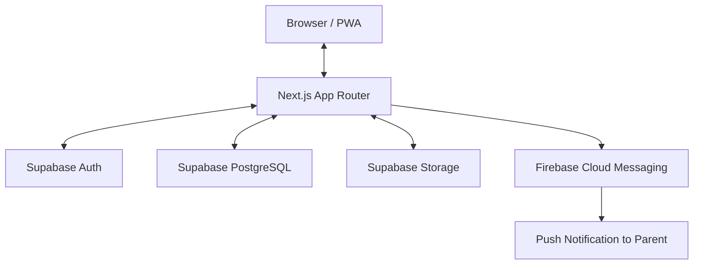
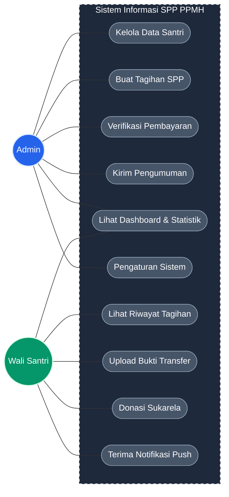
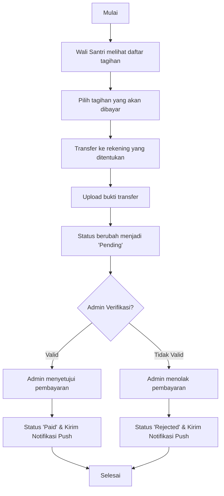
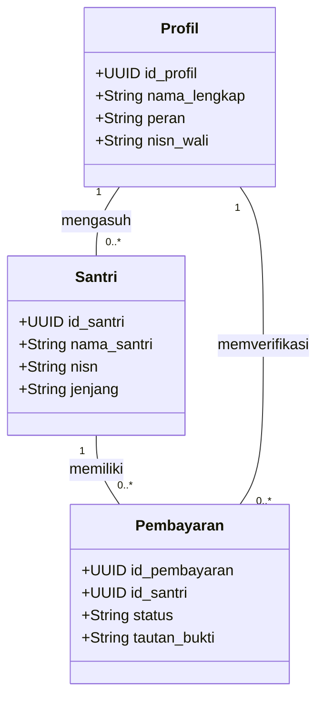

# Perancangan Sistem SPP PPMH

Sistem Informasi Pembayaran (SPP) Pondok Pesantren Minhajush Sholihin (PPMH) adalah platform berbasis web (Progressive Web App - PWA) yang dirancang untuk mendigitalisasi proses penagihan, pembayaran, dan manajemen keuangan pesantren.

## 1. Arsitektur Sistem

Arsitektur sistem ini dibangun menggunakan pola modern *Serverless* yang mengutamakan kecepatan pengembangan dan skalabilitas.

- **Frontend (Next.js 14+)**: Menggunakan *App Router* untuk performa maksimal dan optimasi SEO.
- **Backend (Supabase)**: Database PostgreSQL, autentikasi, dan storage bukti bayar.
- **Firebase Messaging**: Pengiriman notifikasi push ke perangkat wali santri.

*Gambar 1: Alur komunikasi antar komponen sistem.*

## 2. Use Case Diagram (System Boundary - High Contrast)

Diagram ini menggunakan tema **Dark Mode** (Non-Putih) untuk kejelasan visual maksimal dan estetika premium.

## 3. Desain Antarmuka (Interface Design)

Sistem SPP PPMH mengadopsi prinsip desain modern dengan estetika premium yang fokus pada kegunaan (*usability*) dan kenyamanan visual.

### 3.1 Tema dan Estetika
- **Dark Mode Architecture**: Seluruh antarmuka menggunakan palet warna gelap (Deep Navy/Slate) untuk mengurangi kelelahan mata.
- **Glassmorphism**: Komponen kartu (cards) menggunakan efek transparansi dengan *backdrop-blur* untuk memberikan kesan kedalaman dan modernitas.
- **Aksen Warna**: 
    - **Emerald (#10b981)**: Digunakan untuk status 'Lunas' dan tombol konfirmasi.
    - **Sky Blue (#0ea5e9)**: Digunakan untuk navigasi dan elemen branding.
    - **Rose (#f43f5e)**: Digunakan untuk peringatan tagihan tertunggak atau status 'Ditolak'.

### 3.2 Komponen Utama Antarmuka

#### A. Dashboard Admin
- **Statistik Header**: Menampilkan ringkasan total pendapatan bulan berjalan dan sisa tagihan dalam bentuk kartu glassmorphism.
- **Tabel Verifikasi**: Daftar bukti pembayaran yang masuk dengan preview gambar mini (thumbnail).

#### B. Portal Wali Santri (Mobile First)
- **Ringkasan Tagihan**: Menampilkan total tagihan yang harus dibayar di bagian paling atas dengan warna kontras (Amber).
- **History List**: Daftar riwayat pembayaran dalam bentuk *timeline*.

### 3.3 Visual Mockup (Konsep)

*Gambar 3.1: Konsep visual dashboard admin dengan tema Dark Mode.*

---

## 4. Activity Diagram (Alur Pembayaran)

## 5. Class Diagram (Diagram Kelas)

---
**Dokumentasi ini dibuat berdasarkan struktur kode aktif di repository `spp-ppmh-silirsari`.**
